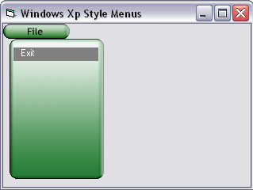

## Windows Xp Style Menus

### Description

If you want to make your programs look alot more attractive and stylish, why not start by replacing the dull menu? This code makes your menus look professional like Windows Xp. Of course it is 100% the same, but it still looks good.
 
### More Info
 

             |
---                |---
**Submitted On**   |2002-02-11 18:28:42
**By**             |[Naveed Ahmed](https://github.com/Planet-Source-Code/PSCIndex/blob/master/ByAuthor/naveed-ahmed.md)
**Level**          |Beginner
**User Rating**    |4.0 (28 globes from 7 users)
**Compatibility**  |VB 3\.0, VB 4\.0 \(16\-bit\), VB 4\.0 \(32\-bit\), VB 5\.0, VB 6\.0
**Category**       |[Custom Controls/ Forms/  Menus](https://github.com/Planet-Source-Code/PSCIndex/blob/master/ByCategory/custom-controls-forms-menus__1-4.md)
**World**          |[Visual Basic](https://github.com/Planet-Source-Code/PSCIndex/blob/master/ByWorld/visual-basic.md)
**Archive File**   |[Windows\_XP546872112002\.zip](https://github.com/Planet-Source-Code/naveed-ahmed-windows-xp-style-menus__1-31713/archive/master.zip)

